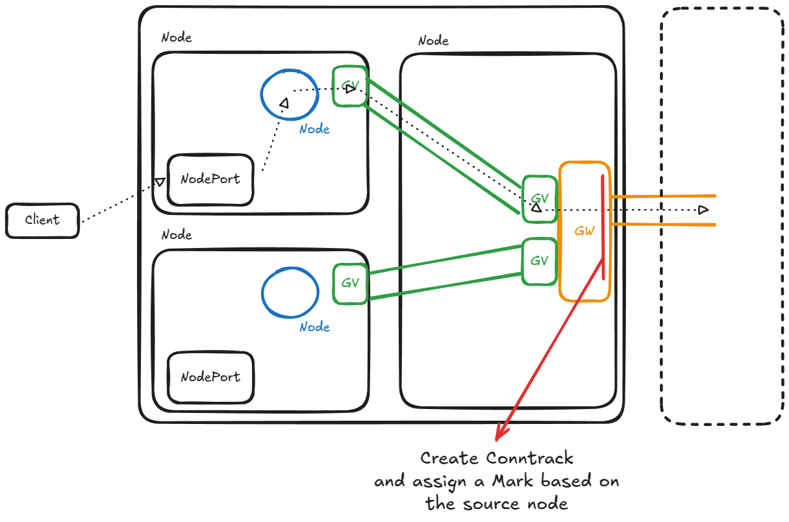
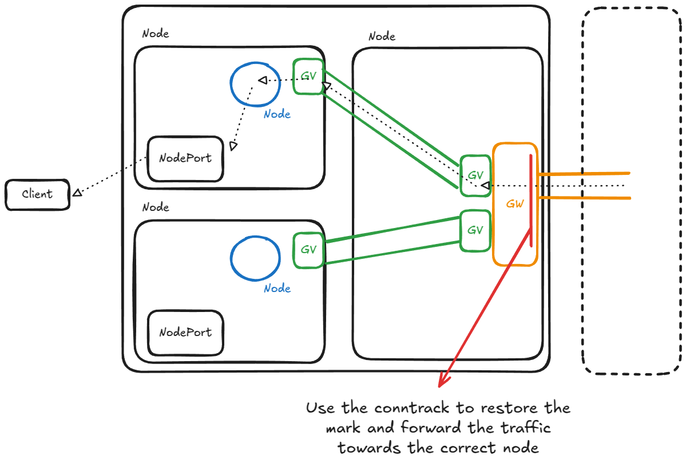
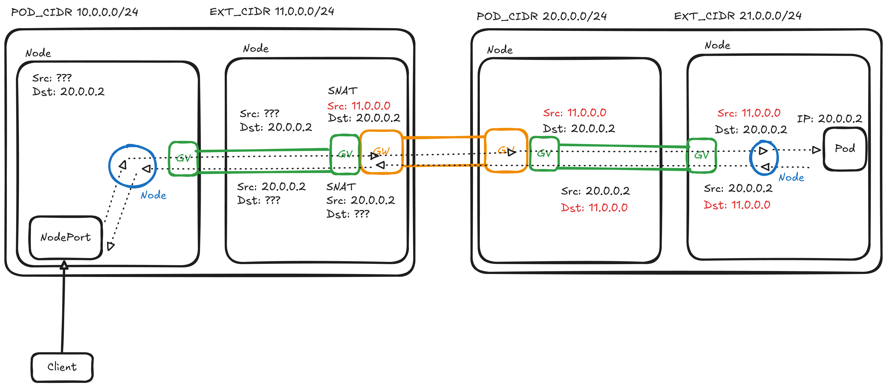
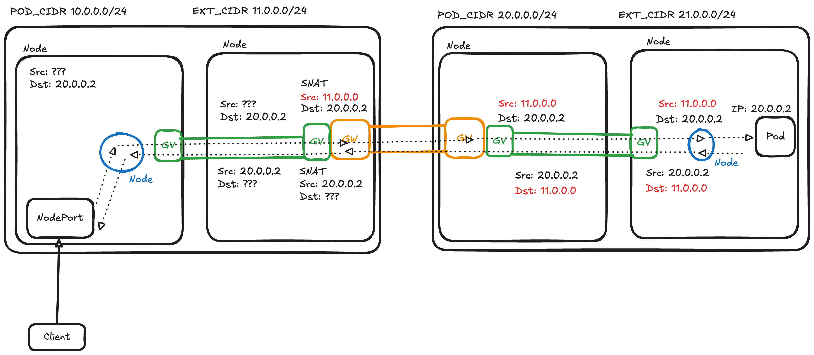

# Use cases

## Handle NodePort traffic

The main challenge with NodePort traffic is the lack of a standardized way to identify the traffic’s origin based on the source IP address.
When traffic reaches a NodePort service, the behavior varies depending on the CNI (Container Network Interface). In some cases, the source IP is source NATed to the first IP of the pod CIDR (which is often reserved for NodePort traffic). In other cases, another IP address is used or source NAT is not applied at all.

Problems arise when this traffic traverses a WireGuard tunnel and needs to return to the cluster where it originated.
When packets from a Pod of Cluster A are directed toward a Pod in cluster B, return traffic can be easily handled by cluster B, as the destination IP address belongs to one of the CIDR assigned to cluster A, so traffic can be forwarded to the right gateway and finally forwarded to the appropriate WireGuard tunnel connecting to the Liqo Gateway in cluster A. However, in the case of NodePort traffic, the source IP address is infrastructure-dependent, making it difficult to determine which cluster originated the traffic.


To address this issue, before traffic leaves cluster A the Liqo’s gateway performs source NAT on traffic coming from unknown IP addresses, rewriting the source IP to the first IP of the tenant’s external CIDR. This ensures that, when the traffic reaches the destination cluster, its source IP is within a known CIDR associated with Cluster A. This allows the response traffic to be routed back through the correct WireGuard tunnel to the originating cluster.

Another aspect to consider is that, once the return traffic reaches the originating cluster, it must exit from the same node where the original request was received. This ensures that traffic **follows the same path in both directions**, which is crucial because some CNIs may drop traffic if it follows a different return path.

To achieve this, a conntrack mark (ctmark) is applied. When traffic exits through a Geneve interface on the gateway (each connected to a specific node), a conntrack entry is created with a mark representing a unique identifier for the node where the traffic was initially received. As each Geneve interface is connected to one of the node, the mark is determined by checking from which Geneve interface the packets came out.



Conntrack stores the traffic quintuple (protocol, source and destination IP addresses, and ports) along with the mark. When return traffic passes through the gateway, the destination IP (which was previously set to the first IP of the external CIDR) is restored to the original source IP. The conntrack entry is matched, and the response packets are tagged with the same mark, identifying the node of origin.



A routing rule based on this mark ensures that traffic is forwarded to the correct Geneve tunnel, ultimately reaching the originating node, where packets are then delivered to their final destination.



### Resources involved

- **IPs**:
  - [\<tenant-name\>-unknown-source](#tenant-name-unknown-source): an IP address allocated to source NAT all traffic from an unknown IP address outgoing to the Gatewayd
- **Firewall Configurations**
  - [service-nodeport-routing](#service-nodeport-routing): containing the ctmark rule to create the contract with the mark corresponding to the node and to add the mark to the packet metadata once the return traffic traverse the gateway.
  - [\<tenant-name\>-masquerade-bypass](#tenant-name-masquerade-bypass-node): one of those rules applies source natting in the node where the gateway is running
- **Routing Configurations**:
  - [\<local-cluster-id\>-\<node-name\>-service-nodeport-routing](#local-cluster-id-node-name-service-nodeport-routing-gateway): the routing rule allowing routing the return traffic to the specific node where the NodePort traffic has been received.


# IP

### Leaf-to-Leaf Communication

The IP resource serves two main purposes:
1. it allocates IPs to prevent other components from using them
2. it maps an IP (e.g. a local IP) to an external CIDR IP, allowing remote adjacent clusters to reach those IPs.

For example, if cluster A is peered with cluster B and an IP resource exists on cluster A with the "local IP" set to 10.111.129.179, its status will be updated with an IP from the local external CIDR. This external IP can then be used by adjacent clusters to reach 10.111.129.179.

This mechanism is useful for leaf-to-leaf communication because cluster A is unaware of the pod CIDR used by cluster C. Cluster B exposes cluster C's pods to A using the IP resource.

IP resources are managed by [a controller](https://github.com/liqotech/liqo/blob/978cc2ce96105507923dd167528946da4413804d/pkg/gateway/remapping/ip_controller.go) that creates firewall configurations (fwcfg) for the gateways.

### \<tenant-name\>-unknown-source

This IP is the first address within the external CIDR. It is used in the **service-nodeport-routing** firewall configuration (see the relevant section). This IP is used when a packet originates from a NodePort on a leaf cluster and needs to reach a pod in another leaf cluster.

**The related _ipmapping-gw_ firewall configuration is not needed.**

# Firewall Configuration

## Labels

TODO

## Before Peering

### service-nodeport-routing

The main challenge with NodePort traffic is that there is no standard way to identify the traffic's origin based on the source IP. For example, when a packet reaches a node on the correct port, it may or may not be source NATed, and the source IP used depends on the CNI. To address this, Liqo always uses the first IP of the external CIDR to source NAT traffic received on a NodePort.



This firewall configuration does not apply the source NAT mentioned above. Instead, it contains a **ctmark** rule that creates a conntrack entry with a **mark** (a unique number for each node). Another prerouting chain then matches all traffic from other clusters with the first external CIDR IP as the destination and uses conntrack to apply the mark. A [policy routing rule](#local-cluster-id-node-name-service-nodeport-routing-gateway) then uses this mark to forward packets to the original node. This is necessary because return NodePort traffic from the remote cluster always has the same destination IP. **Ensuring the same path is followed in both directions** is best practice, as some CNIs block traffic that takes a different return path.

For further info check [how NodePort traffic is handled](#handle-nodeport-traffic).

### \<node-name\>-gw-masquerade-bypass

Some CNIs masquerade traffic from a pod to a node (not running the pod) using the node's internal IP. For example, if a pod has IP 10.0.0.8 and is scheduled on a node with internal IP 192.168.0.5, pinging another node will result in packets with 192.168.0.5 as the source IP.

This behavior has been observed in the following scenarios:

- Azure CNI
- Calico (when pod masquerade is enabled, e.g., Crownlabs)
- KindNet

This can be problematic because Geneve does not support NAT (or IP changes) between the two hosts. When a Geneve tunnel needs to be established (such as between gateway pods and nodes), both hosts must be able to "ping" each other using the IP assigned to their network interface.
In the case described above, the source address of the packets from the Gateway pod directed to one of the node via the Geneve tunnel is masquerated with the IP address of where the Gateway pod is running.

This firewall configuration solves the issue using the same approach as the **\<tenant\>-masquerade-bypass** configuration. The double SNAT trick is also used here to prevent masquerading. That's because a SNAT rule that enforces a specific IP address nullify any subsequent SNAT rules targetting that address. The same applies to DNAT rules.
For instance , if a packet uses 10.0.0.1 as the source IP, a SNAT that enforces 10.0.0.1 will nullify any subsequent SNAT rules targetting 10.0.0.1.
Which means that if a SNAT is applied on traffic coming from the IP address of the gateway and enforces its same IP address, prevents the CNI from source natting packets from the gateway with the IP address of the node.
Whenever a gateway pod is scheduled on a node, a rule is added only on that specific node (whose name is reported in the label `networking.liqo.io/firewall-unique`). It matches only traffic with the gateway IP as the source and the Geneve port as the destination.

```yaml
apiVersion: networking.liqo.io/v1beta1
kind: FirewallConfiguration
metadata:
  labels:
    liqo.io/managed: "true"
    networking.liqo.io/firewall-category: fabric
    networking.liqo.io/firewall-subcategory: single-node
    networking.liqo.io/firewall-unique: cheina-cluster1-worker2
    networking.liqo.io/gateway-masquerade-bypass: "true"
  name: cheina-cluster1-worker2-gw-masquerade-bypass
  namespace: liqo
spec:
  table:
    chains:
      - hook: postrouting
        name: pre-postrouting
        policy: accept
        priority: 99
        rules:
          natRules:
            - match:
                - ip:
                    position: src
                    value: 10.127.65.33
                  op: eq
                  port:
                    position: dst
                    value: "6091"
                  proto:
                    value: udp
              name: gw-cheina-cluster2-66bc45dd78-75d9j
              natType: snat
              targetRef:
                kind: Pod
                name: gw-cheina-cluster2-66bc45dd78-75d9j
                namespace: liqo-tenant-cheina-cluster2
              to: 10.127.65.33
        type: nat
    family: IPV4
    name: cheina-cluster1-worker2-gw-masquerade-bypass
```

## After Peering

### \<tenant-name\>-masquerade-bypass (Node)

This firewall configuration contains several rules with different purposes.

Geneve requires that two hosts can communicate directly, without IP changes in between (e.g., no NAT allowed). Sometimes CNIs apply a SNAT (using the node's primary IP) when traffic originates from pods and attempts to reach a node. These rules nullify such SNATs by applying a redundant SNAT. For instance, if a packet uses 10.0.0.1 as the source IP, a SNAT that enforces 10.0.0.1 will nullify any subsequent SNAT rules. The same applies to DNAT rules.
**? Maybe wrong, does not explaing the following rule**

```yaml
- match:
    - ip:
        position: dst
        value: 10.71.0.0/18
      op: eq
    - ip:
        position: src
        value: 10.127.64.0/18
      op: eq
  name: podcidr-cheina-cluster2
  natType: snat
  to: 10.127.64.0/18
```

The following rules enforce the presence of the first external CIDR IP in packets received by NodePort services. Refer to the **service-nodeport-routing** firewall configuration for more details.

```yaml
- match:
    - ip:
      	position: dst
        value: 10.71.0.0/18
      op: eq
    - ip:
      	position: src
        value: 10.127.64.0/18
      op: neq
  name: service-nodeport-cheina-cluster2
  natType: snat
  to: 10.70.0.0
```

The other rules apply the same concept but for the external CIDR.

**This rule is the reason why NodePorts do not work with Cilium without kube-proxy. With no-kubeproxy, Cilium uses eBPF to manage firewall rules, so this fwcfg is bypassed. A future solution should consider moving this rule inside the Gateway.**

**? Cosa ha impedito adesso questo spostamento? A parole sembra semplice**

#### Full-Masquerade

When the flag **networking.fabric.config.fullMasquerade** is **true**, this firewall configuration changes. In particular, the **service-nodeport-\<cheina-cluster2\>** rule becomes the only one still present, and its match rules do not include a check on the source IP of the packets.

```yaml
- match:
    - ip:
      	position: dst
        value: 10.71.0.0/18
      op: eq
  name: service-nodeport-cheina-cluster2
  natType: snat
  to: 10.70.0.0
```

This rule directs all traffic destined for the remote cluster to use the **unknown IP** as the source IP. This means that the remote traffic will see all incoming traffic from its peered cluster as originating from the first external CIDR IP.

This is useful when the cluster's NodePorts use a PodCIDR IP to masquerade the incoming traffic.
**? Perchè è utile cosa cambia dal punto di vista di Liqo?**

### \<tenant-name\>-remap-podcidr (Gateway)

This rule manages the CIDR remapping in cases where two clusters have the same pod CIDR. It contains two rules.

Before continuing, let's recap how this works:

Imagine we have two clusters named Cluster A and Cluster B, both with the same pod CIDR (e.g., 10.1.0.0/16). Each cluster can remap the CIDR of the adjacent one, even if they are the same. Cluster A can autonomously decide on a new CIDR to identify Cluster B's pods. When Cluster A wants to send traffic to Cluster B, it will use the new remapped CIDR. This rule's purpose is to translate the "fake" destination IP back to the real one. Note that this rule ignores traffic coming from eth0 and liqo-tunnel, as traffic from the pods will be received on Geneve interfaces (liqo-xxx).

```yaml
- match:
    - ip:
        position: dst
        value: 10.71.0.0/18
      op: eq
    - dev:
        position: in
        value: eth0
      op: neq
    - dev:
        position: in
        value: liqo-tunnel
      op: neq
  name: 17b97d17-aa77-4494-bf9c-d307600f37af
  natType: dnat
  to: 10.127.64.0/18
```

This rule performs the opposite function for packets coming from the other cluster. It maps the packet's source IP using the remapped CIDR, which is necessary for routing the returning packets, that's why source natting is applied only to `liqo-tunnel`, which is the interface of the wireguard tunnel:

```yaml
- match:
    - dev:
        position: out
        value: eth0
      op: neq
    - ip:
        position: src
        value: 10.127.64.0/18
      op: eq
    - dev:
        position: in
        value: liqo-tunnel
      op: eq
  name: 75b6467c-4ce3-4434-8e18-9b4f568c12c7
  natType: snat
  to: 10.71.0.0/18
```

### \<tenant-name\>-remap-externalcidr (Gateway)

Functions similarly to **\<tenant-name\>-remap-podcidr** but for the **external-cidr**.

### \<name\>-remap-ipmapping-gw

These firewall configurations are created from IP resources (refer to the IP section), containing SNAT and DNAT rules to make the "local IP" reachable through the external CIDR.

# Route Configuration

Route configurations use policy routing only.

## Labels

TODO

## Before Peering

### \<local-cluster-id\>-\<node-name\>-extcidr (Gateway)

Contains all the routes that match traffic targeting the local external CIDR.

```yaml
apiVersion: networking.liqo.io/v1beta1
kind: RouteConfiguration
metadata:
  labels:
    liqo.io/managed: "true"
    networking.liqo.io/route-category: gateway
    networking.liqo.io/route-subcategory: fabric-node
    networking.liqo.io/route-unique: cheina-cluster1-worker
  name: cheina-cluster1-worker-extcidr
  namespace: liqo
spec:
  table:
    name: cheina-cluster1-worker-extcidr
    rules:
      - iif: liqo-tunnel
        routes:
          - dev: liqo.cjntnn4bdj
            dst: 10.111.105.133/32
            gw: 10.80.0.3
          - dev: liqo.cjntnn4bdj
            dst: 10.111.0.1/32
            gw: 10.80.0.3
```

### \<local-cluster-id\>-\<node-name\>-service-nodeport-routing (Gateway)

These rules use marks with policy routing to route the returning traffic towards the correct node. Refer to the **service-nodeport-routing** firewall configuration for more details.

```yaml
apiVersion: networking.liqo.io/v1beta1
kind: RouteConfiguration
metadata:
  labels:
    liqo.io/managed: "true"
    networking.liqo.io/route-category: gateway
    networking.liqo.io/route-subcategory: fabric
  name: cheina-cluster1-control-plane-service-nodeport-routing
  namespace: liqo
spec:
  table:
    name: cheina-cluster1-control-plane-service-nodeport-routing
    rules:
      - dst: 10.70.0.0/32
        fwmark: 2
        routes:
          - dev: liqo.jdr5xndgmb
            dst: 10.70.0.0/32
            gw: 10.80.0.2
        targetRef:
          kind: InternalNode
          name: cheina-cluster1-control-plane
```

### \<local-cluster-id\>-\<node-name\>-gw-node (Gateway)

Contains the rule that allows traffic from the gateway to nodes using Geneve tunnels. Note that Liqo uses the internal CIDR to assign an IP to every Geneve interface. If you need to debug the traffic between Geneve interfaces, you can ping each interface. This is the first rule in the
**? Frase mancante**

Also contains a route for each pod in the cluster. These routes allow traffic coming from other clusters to be forwarded to the correct node. This is necessary because Kubernetes does not provide a standard way to determine the pod CIDR range used for each node.
**? Non sono sicuro di aver capito, forse sarebbe carino scrivere un paragrafo in use case come nel caso delle nodeport**

```yaml
apiVersion: networking.liqo.io/v1beta1
kind: RouteConfiguration
metadata:
  labels:
    liqo.io/managed: "true"
    networking.liqo.io/route-category: gateway
    networking.liqo.io/route-subcategory: fabric
  name: cheina-cluster1-control-plane-gw-node
  namespace: liqo
spec:
  table:
    name: cheina-cluster1-control-plane
    rules:
      - dst: 10.80.0.2/32
        routes:
          - dev: liqo.jdr5xndgmb
            dst: 10.80.0.2/32
            scope: link
      - iif: liqo-tunnel
        routes:
          - dst: 10.112.0.229/32
            gw: 10.80.0.2
            targetRef:
              kind: Pod
              name: coredns-9ff4c5cf6-xbx5w
              namespace: kube-system
              uid: 3cb83b91-98b5-412c-b5a2-f1ebe28497df
```

### \<local-cluster-id\>-gw-ext (Gateway)

This route configuration contains all the routes that forward traffic from a gateway to another. It includes rules for remote pod CIDRs and external CIDRs.

Note that the routes with a destination of 10.70.0.0/16 are related to the external CIDR. It may seem strange since it is not using a remapped CIDR, but this is because the DNAT rules (which translate from remapped CIDR to original CIDR) act in **prerouting**.

```yaml
apiVersion: networking.liqo.io/v1beta1
kind: RouteConfiguration
metadata:
  labels:
    liqo.io/managed: "true"
    networking.liqo.io/route-category: gateway
    networking.liqo.io/route-unique: cheina-cluster2
  name: cheina-cluster2-gw-ext
  namespace: liqo-tenant-cheina-cluster2
spec:
  table:
    name: cheina-cluster2
    rules:
      - dst: 10.122.0.0/16
        iif: liqo.fgckffk4dv
        routes:
          - dst: 10.122.0.0/16
            gw: 169.254.18.1
      - dst: 10.70.0.0/16
        iif: liqo.fgckffk4dv
        routes:
          - dst: 10.70.0.0/16
            gw: 169.254.18.1
      - dst: 10.122.0.0/16
        iif: liqo.jdr5xndgmb
        routes:
          - dst: 10.122.0.0/16
            gw: 169.254.18.1
      - dst: 10.70.0.0/16
        iif: liqo.jdr5xndgmb
        routes:
          - dst: 10.70.0.0/16
            gw: 169.254.18.1
      - dst: 10.122.0.0/16
        iif: liqo.cjntnn4bdj
        routes:
          - dst: 10.122.0.0/16
            gw: 169.254.18.1
      - dst: 10.70.0.0/16
        iif: liqo.cjntnn4bdj
        routes:
          - dst: 10.70.0.0/16
            gw: 169.254.18.1
```

### \<local-cluster-id\>-node-gw (Node)

This route configuration contains the routes to reach the "other" side of the Geneve tunnel. It also includes all the routes that point to the remote cluster's pod CIDR and external CIDR.

```yaml
apiVersion: networking.liqo.io/v1beta1
kind: RouteConfiguration
metadata:
  labels:
    liqo.io/managed: "true"
    networking.liqo.io/route-category: fabric
  name: cheina-cluster2-node-gw
  namespace: liqo-tenant-cheina-cluster2
spec:
  table:
    name: cheina-cluster2-node-gw
    rules:
      - dst: 10.80.0.4/32
        routes:
          - dev: liqo.7hr82v9br5
            dst: 10.80.0.4/32
            scope: link
      - dst: 10.68.0.0/16
        routes:
          - dst: 10.68.0.0/16
            gw: 10.80.0.4
      - dst: 10.71.0.0/18
        routes:
          - dst: 10.71.0.0/18
            gw: 10.80.0.4
```

# InternalNode

When a pod using the **host network** communicates with a regular pod, the source IP address depends on the location of the target pod. If the target pod is on the same node, one source IP is used; if the target pod is on a different node, a different source IP is used.

> Please note that this behaviour can change depending on the CNI used.

The InternalNode resource stores the information about which IP is used to reach the node itself and which IP is used to reach the other cluster's nodes.

This information is provided using `ip route get <gw-ip>` on each node and getting the src IP from the output. That command allows to understand what network interface will be used to reach the gateway pod.

This information is fundamental to enstablish the geneve tunnels, because each gateway need to know what IP to use to reach a node. Remember that geneve wants that the couple src/dst IP used in one way is the same used in the other way.

In this example, the gateway for the remote cluster **cheina-cluster2** is scheduled on the node **cheina-cluster1-worker4**. The internal IP of the node **cheina-cluster1-worker4** is **10.112.2.188** and liqo is able to understand it running the command `ip route get 10.112.2.170` (where `10.112.2.170` is the IP address of pod of the Gateway) on the node **cheina-cluster1-worker4**.
The same command is executed for each of the other nodes to get the **remote IP** used by the Gateways to create a Geneve tunnel with each of the nodes of the cluster.

Note that the IPs defined in the InternalNode resources are valid for each of the gateways created in the cluster and they are divided into local and remote because each gateway use the local address to create a tunnel between the Gateway pod and the Node where it is running, and the remote address to create a tunnel with all the other nodes.

```
kubectl get internalnode -o wide
NAME                            NODE IP LOCAL   NODE IP REMOTE   AGE
cheina-cluster1-control-plane                   10.112.0.132     9m36s
cheina-cluster1-worker                          10.112.4.211     9m36s
cheina-cluster1-worker2                         10.112.3.19      9m36s
cheina-cluster1-worker3                         10.112.1.2       9m36s
cheina-cluster1-worker4         10.112.2.188                     9m36s
```

```
kubectl get pods -l networking.liqo.io/component=gateway -A -o wide
NAMESPACE                     NAME                                 READY   STATUS    IP             NODE
liqo-tenant-cheina-cluster2   gw-cheina-cluster2-c5bd76b56-7mxd4   3/3     Running   10.112.2.170   cheina-cluster1-worker4
```

# Debug commands

- `tcpdump -tnl -i any \<protocol\>`: capture all traffic for a specific protocol (e.g., `tcp`, `udp`, `icmp`, etc.)
- `tcpdump -tnl -i any tcp port 8080`: capture all TCP traffic on port 8080
- `tcpdump -tnl -i any tcp dst port 8080`: capture traffic destined to port 8080
- `conntrack -D`: delete all the conntrack entries
- `conntrack -L`: list all the conntrack entries
- `nft list ruleset`: list all the rules in the nftables
