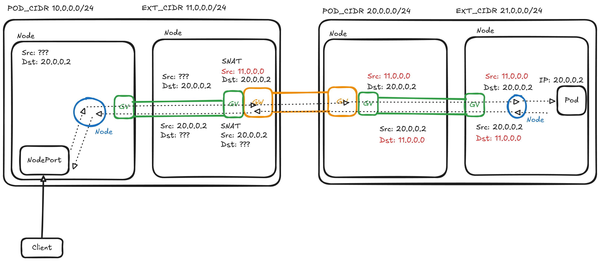
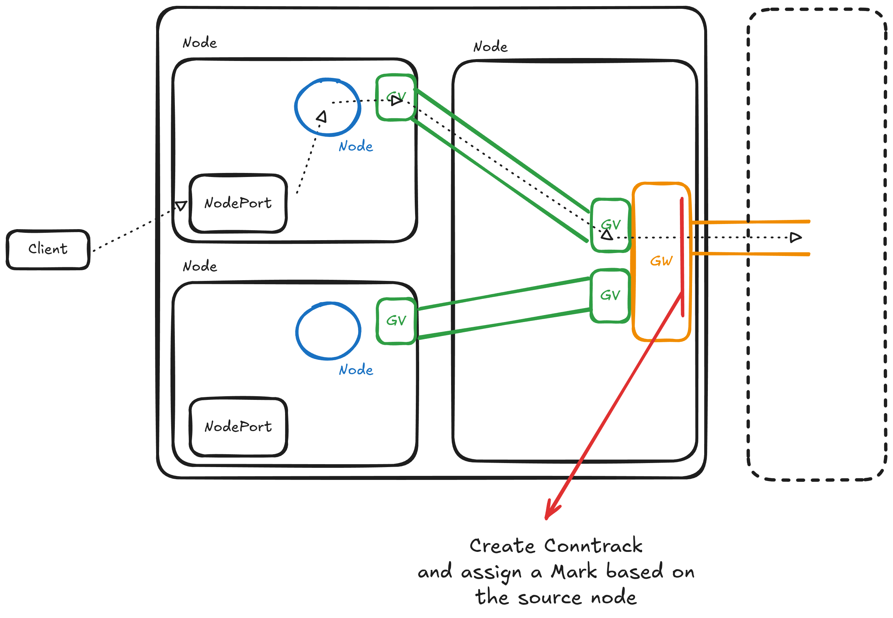
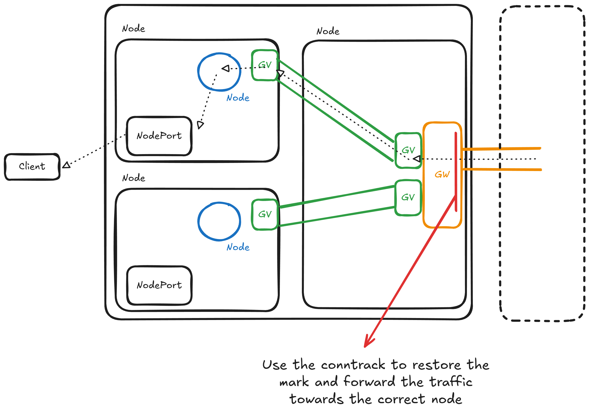

# IP

### Leaf-to-Leaf Communication

The IP resource serves two main purposes. First, it allocates IPs to prevent other components from using them. Second, it maps local IPs to an external CIDR IP, allowing remote adjacent clusters to reach those IPs. For example, if cluster A is peered with cluster B and an IP resource exists on cluster A with the "local IP" set to 10.111.129.179, its status will be updated with an IP from the local external CIDR. This external IP can then be used by adjacent clusters to reach 10.111.129.179.

This mechanism is useful for leaf-to-leaf communication because cluster A is unaware of the pod CIDR used by cluster C. Cluster B exposes cluster C's pods to A using the IP resource.

IP resources are managed by a controller that creates firewall configurations (fwcfg) for the gateways.

### \<tenant-name\>-unknown-source

This IP is the first address within the external CIDR. It is used in the **service-nodeport-routing** firewall configuration (see the relevant section). This IP is used when a packet originates from a NodePort on a leaf cluster and needs to reach a pod in another leaf cluster.

**The related _ipmapping-gw_ firewall configuration is not needed.**

# Firewall Configuration

## Labels

TODO

## Before Peering

### service-nodeport-routing

The main challenge with NodePort traffic is that there is no standard way to identify the traffic's origin based on the source IP. For example, when a packet reaches a node on the correct port, it may or may not be source NATed, and the source IP used depends on the CNI. To address this, Liqo always uses the first IP of the external CIDR to source NAT traffic received on a NodePort.



This firewall configuration does not apply the source NAT mentioned above. Instead, it contains a **ctmark** rule that creates a conntrack entry with a **mark** (a unique number for each node). Another prerouting chain then matches all traffic from other clusters with the first external CIDR IP as the destination and uses conntrack to apply the mark. A policy routing rule then uses this mark to forward packets to the original node. This is necessary because return NodePort traffic from the remote cluster always has the same destination IP. **Ensuring the same path is followed in both directions** is best practice, as some CNIs block traffic that takes a different return path.





### \<node-name\>-gw-masquerade-bypass

Some CNIs masquerade traffic from a pod to a node (not running the pod) using the node's internal IP. For example, if a pod has IP 10.0.0.8 and is scheduled on a node with internal IP 192.168.0.5, pinging another node will result in packets with 192.168.0.5 as the source IP.

This behavior has been observed in the following scenarios:

- Azure CNI
- Calico (when pod masquerade is enabled, e.g., Crownlabs)
- KindNet

This can be problematic because Geneve does not support NAT (or IP changes) between the two hosts. When a Geneve tunnel needs to be established (such as between gateway pods and nodes), both hosts must be able to "ping" each other using the IP assigned to their network interface.

This firewall configuration solves the issue using the same approach as the **\<tenant\>-masquerade-bypass** configuration. The double SNAT trick is also used here to prevent masquerading. Whenever a gateway pod is scheduled on a node, a rule is added only on that specific node (with the label `networking.liqo.io/firewall-unique`). It matches only traffic with the gateway IP as the source and the Geneve port as the destination.

```yaml
apiVersion: networking.liqo.io/v1beta1
kind: FirewallConfiguration
metadata:
  labels:
    liqo.io/managed: "true"
    networking.liqo.io/firewall-category: fabric
    networking.liqo.io/firewall-subcategory: single-node
    networking.liqo.io/firewall-unique: cheina-cluster1-worker2
    networking.liqo.io/gateway-masquerade-bypass: "true"
  name: cheina-cluster1-worker2-gw-masquerade-bypass
  namespace: liqo
spec:
  table:
    chains:
      - hook: postrouting
        name: pre-postrouting
        policy: accept
        priority: 99
        rules:
          natRules:
            - match:
                - ip:
                    position: src
                    value: 10.127.65.33
                  op: eq
                  port:
                    position: dst
                    value: "6091"
                  proto:
                    value: udp
              name: gw-cheina-cluster2-66bc45dd78-75d9j
              natType: snat
              targetRef:
                kind: Pod
                name: gw-cheina-cluster2-66bc45dd78-75d9j
                namespace: liqo-tenant-cheina-cluster2
              to: 10.127.65.33
        type: nat
    family: IPV4
    name: cheina-cluster1-worker2-gw-masquerade-bypass
```

## After Peering

### \<tenant-name\>-masquerade-bypass (Node)

This firewall configuration contains several rules with different purposes.

Geneve requires that two hosts can communicate directly, without IP changes in between (e.g., no NAT allowed). Sometimes CNIs apply a SNAT (using the node's primary IP) when traffic originates from pods and attempts to reach a node. These rules nullify such SNATs by applying a redundant SNAT. For instance, if a packet uses 10.0.0.1 as the source IP, a SNAT that enforces 10.0.0.1 will nullify any subsequent SNAT rules. The same applies to DNAT rules.

```yaml
- match:
    - ip:
        position: dst
        value: 10.71.0.0/18
      op: eq
    - ip:
        position: src
        value: 10.127.64.0/18
      op: eq
  name: podcidr-cheina-cluster2
  natType: snat
  to: 10.127.64.0/18
```

The following rules enforce the presence of the first external CIDR IP in packets received by NodePort services. Refer to the **service-nodeport-routing** firewall configuration for more details.

```yaml
- match:
	- ip:
      	position: dst
        value: 10.71.0.0/18
      op: eq
    - ip:
      	position: src
        value: 10.127.64.0/18
      op: neq
  name: service-nodeport-cheina-cluster2
  natType: snat
  to: 10.70.0.0
```

The other rules apply the same concept but for the external CIDR.

**This rule is the reason why NodePorts do not work with Cilium without kube-proxy. With no-kubeproxy, Cilium uses eBPF to manage firewall rules, so this fwcfg is bypassed. A future solution should consider moving this rule inside the Gateway.**

#### Full-Masquerade

When the flag **networking.fabric.config.fullMasquerade** is **true**, this firewall configuration changes. In particular, the **service-nodeport-\<cheina-cluster2\>** rule becomes the only one still present, and its match rules do not include a check on the source IP of the packets.

```yaml
- match:
	- ip:
      	position: dst
        value: 10.71.0.0/18
      op: eq
  name: service-nodeport-cheina-cluster2
  natType: snat
  to: 10.70.0.0
```

This rule directs all traffic destined for the remote cluster to use the **unknown IP** as the source IP. This means that the remote traffic will see all incoming traffic from its peered cluster as originating from the first external CIDR IP.

This is useful when the cluster's NodePorts use a PodCIDR IP to masquerade the incoming traffic.

### \<tenant-name\>-remap-podcidr (Gateway)

This rule manages the CIDR remapping in cases where two clusters have the same pod CIDR. It contains two rules.

Before continuing, let's recap how this works:

Imagine we have two clusters named Cluster A and Cluster B, both with the same pod CIDR (e.g., 10.1.0.0/16). Each cluster can remap the CIDR of the adjacent one, even if they are the same. Cluster A can autonomously decide on a new CIDR to identify Cluster B's pods. When Cluster A wants to send traffic to Cluster B, it will use the new remapped CIDR. This rule's purpose is to translate the "fake" destination IP back to the real one. Note that this rule ignores traffic coming from eth0, as traffic from the pods will be received on Geneve interfaces (liqo-xxx).

```yaml
- match:
    - ip:
        position: dst
        value: 10.71.0.0/18
      op: eq
    - dev:
        position: in
        value: eth0
      op: neq
    - dev:
        position: in
        value: liqo-tunnel
      op: neq
  name: 17b97d17-aa77-4494-bf9c-d307600f37af
  natType: dnat
  to: 10.127.64.0/18
```

This rule performs the opposite function for packets coming from the other cluster. It maps the packet's source IP using the remapped CIDR, which is necessary for routing the returning packets.

```yaml
- match:
    - dev:
        position: out
        value: eth0
      op: neq
    - ip:
        position: src
        value: 10.127.64.0/18
      op: eq
    - dev:
        position: in
        value: liqo-tunnel
      op: eq
  name: 75b6467c-4ce3-4434-8e18-9b4f568c12c7
  natType: snat
  to: 10.71.0.0/18
```

### \<tenant-name\>-remap-externalcidr (Gateway)

Functions similarly to **\<tenant-name\>-remap-podcidr** but for the **external-cidr**.

### \<name\>-remap-ipmapping-gw

These firewall configurations are created from IP resources (refer to the IP section), containing SNAT and DNAT rules to make the "local IP" reachable through the external CIDR.

# Route Configuration

Route configurations use policy routing only.

## Labels

TODO

## Before Peering

### \<local-cluster-id\>-\<node-name\>-extcidr (Gateway)

Contains all the routes that match traffic targeting the local external CIDR.

```yaml
apiVersion: networking.liqo.io/v1beta1
kind: RouteConfiguration
metadata:
  labels:
    liqo.io/managed: "true"
    networking.liqo.io/route-category: gateway
    networking.liqo.io/route-subcategory: fabric-node
    networking.liqo.io/route-unique: cheina-cluster1-worker
  name: cheina-cluster1-worker-extcidr
  namespace: liqo
spec:
  table:
    name: cheina-cluster1-worker-extcidr
    rules:
      - iif: liqo-tunnel
        routes:
          - dev: liqo.cjntnn4bdj
            dst: 10.111.105.133/32
            gw: 10.80.0.3
          - dev: liqo.cjntnn4bdj
            dst: 10.111.0.1/32
            gw: 10.80.0.3
```

### \<local-cluster-id\>-\<node-name\>-service-nodeport-routing (Gateway)

These rules use marks with policy routing to route the returning traffic towards the correct node. Refer to the **service-nodeport-routing** firewall configuration for more details.

```yaml
apiVersion: networking.liqo.io/v1beta1
kind: RouteConfiguration
metadata:
  labels:
    liqo.io/managed: "true"
    networking.liqo.io/route-category: gateway
    networking.liqo.io/route-subcategory: fabric
  name: cheina-cluster1-control-plane-service-nodeport-routing
  namespace: liqo
spec:
  table:
    name: cheina-cluster1-control-plane-service-nodeport-routing
    rules:
      - dst: 10.70.0.0/32
        fwmark: 2
        routes:
          - dev: liqo.jdr5xndgmb
            dst: 10.70.0.0/32
            gw: 10.80.0.2
        targetRef:
          kind: InternalNode
          name: cheina-cluster1-control-plane
```

### \<local-cluster-id\>-\<node-name\>-gw-node (Gateway)

Contains the rule that allows traffic from the gateway to nodes using Geneve tunnels. Note that Liqo uses the internal CIDR to assign an IP to every Geneve interface. If you need to debug the traffic between Geneve interfaces, you can ping each interface. This is the first rule in the

Also contains a route for each pod in the cluster. These routes allow traffic coming from other clusters to be forwarded to the correct node. This is necessary because Kubernetes does not provide a standard way to determine the pod CIDR range used for each node.

```yaml
apiVersion: networking.liqo.io/v1beta1
kind: RouteConfiguration
metadata:
  labels:
    liqo.io/managed: "true"
    networking.liqo.io/route-category: gateway
    networking.liqo.io/route-subcategory: fabric
  name: cheina-cluster1-control-plane-gw-node
  namespace: liqo
spec:
  table:
    name: cheina-cluster1-control-plane
    rules:
      - dst: 10.80.0.2/32
        routes:
          - dev: liqo.jdr5xndgmb
            dst: 10.80.0.2/32
            scope: link
      - iif: liqo-tunnel
        routes:
          - dst: 10.112.0.229/32
            gw: 10.80.0.2
            targetRef:
              kind: Pod
              name: coredns-9ff4c5cf6-xbx5w
              namespace: kube-system
              uid: 3cb83b91-98b5-412c-b5a2-f1ebe28497df
```

### \<local-cluster-id\>-gw-ext (Gateway)

This route configuration contains all the routes that forward traffic from a gateway to another. It includes rules for remote pod CIDRs and external CIDRs.

Note that the routes with a destination of 10.70.0.0/16 are related to the external CIDR. It may seem strange since it is not using a remapped CIDR, but this is because the DNAT rules (which translate from remapped CIDR to original CIDR) act in **prerouting**.

```yaml
apiVersion: networking.liqo.io/v1beta1
kind: RouteConfiguration
metadata:
  labels:
    liqo.io/managed: "true"
    networking.liqo.io/route-category: gateway
    networking.liqo.io/route-unique: cheina-cluster2
  name: cheina-cluster2-gw-ext
  namespace: liqo-tenant-cheina-cluster2
spec:
  table:
    name: cheina-cluster2
    rules:
      - dst: 10.122.0.0/16
        iif: liqo.fgckffk4dv
        routes:
          - dst: 10.122.0.0/16
            gw: 169.254.18.1
      - dst: 10.70.0.0/16
        iif: liqo.fgckffk4dv
        routes:
          - dst: 10.70.0.0/16
            gw: 169.254.18.1
      - dst: 10.122.0.0/16
        iif: liqo.jdr5xndgmb
        routes:
          - dst: 10.122.0.0/16
            gw: 169.254.18.1
      - dst: 10.70.0.0/16
        iif: liqo.jdr5xndgmb
        routes:
          - dst: 10.70.0.0/16
            gw: 169.254.18.1
      - dst: 10.122.0.0/16
        iif: liqo.cjntnn4bdj
        routes:
          - dst: 10.122.0.0/16
            gw: 169.254.18.1
      - dst: 10.70.0.0/16
        iif: liqo.cjntnn4bdj
        routes:
          - dst: 10.70.0.0/16
            gw: 169.254.18.1
```

### \<local-cluster-id\>-node-gw (Node)

This route configuration contains the routes to reach the "other" side of the Geneve tunnel. It also includes all the routes that point to the remote cluster's pod CIDR and external CIDR.

```yaml
apiVersion: networking.liqo.io/v1beta1
kind: RouteConfiguration
metadata:
  labels:
    liqo.io/managed: "true"
    networking.liqo.io/route-category: fabric
  name: cheina-cluster2-node-gw
  namespace: liqo-tenant-cheina-cluster2
spec:
  table:
    name: cheina-cluster2-node-gw
    rules:
      - dst: 10.80.0.4/32
        routes:
          - dev: liqo.7hr82v9br5
            dst: 10.80.0.4/32
            scope: link
      - dst: 10.68.0.0/16
        routes:
          - dst: 10.68.0.0/16
            gw: 10.80.0.4
      - dst: 10.71.0.0/18
        routes:
          - dst: 10.71.0.0/18
            gw: 10.80.0.4
```

# Debug commands

- tcpdump -tnl -i any \<protocol\>
- tcpdump -tnl -i any tcp port 8080
- tcpdump -tnl -i any tcp dst port 8080
