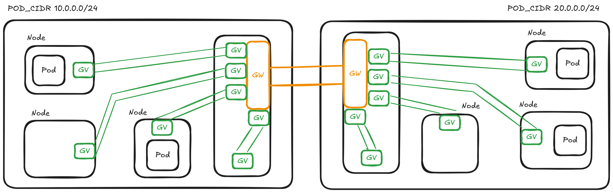
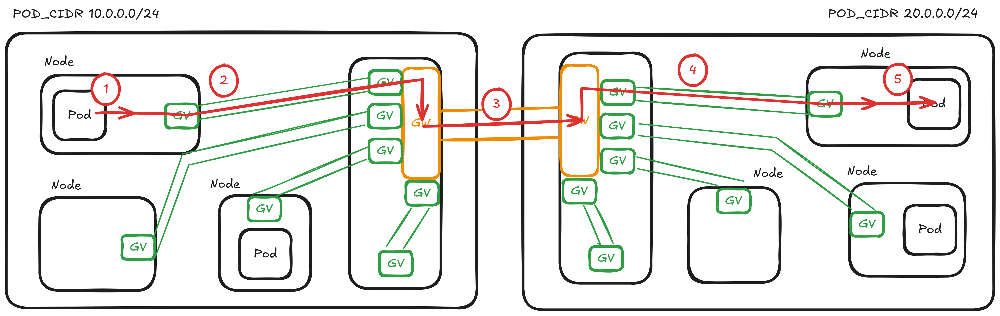

# Basic Concepts

Liqo network is a cloud-native solution that enables seamless communication between Kubernetes clusters. In particular, it allows pod-to-pod communication across clusters. This means that the **services** and **endpointslices** reflection is not managed by the networking module (it is managed by the virtual-kubelet).

The 2 main areas of the Liqo network are:

- **Internal network**: it manages the traffic inside the cluster and forwards it between nodes and gateways. It uses the Geneve protocol to encapsulate the traffic (the green tunnels in the image below).
- **External network**: it manages the traffic between different clusters. It uses WireGuard to create a secure tunnel between gateways (the yellow tunnels in the image below).

## Internal network

In the internal network, every node is connected to a different gateway using a dedicated Geneve tunnel. This architecture ensures that:

- For each node, there is a dedicated Geneve interface on every gateway.
- For each gateway, there is a dedicated Geneve interface on every node.

Each Geneve interface is assigned an IP address from the **internal CIDR**. This allows the interfaces to be reachable and enables you to ping the Geneve interfaces both from the node and from the gateway, facilitating connectivity checks and troubleshooting.

## External network

In the external network, traffic between different clusters is managed.

Each WireGuard tunnel is created inside a dedicated gateway pod. For every peering, a dedicated gateway pod is deployed in both clusters involved in the connection. Each gateway pod establishes a secure WireGuard tunnel that connects only to a single remote cluster. This means that every gateway can point to just one remote cluster, ensuring isolation and security for each inter-cluster connection.

There are two types of gateway pods: **gateway-client** and **gateway-server**.

- The **gateway-client** acts as a WireGuard client, initiating the connection to the remote cluster.
- The **gateway-server** acts as a WireGuard server, accepting incoming connections from remote clients. The gateway-server must expose itself using a Kubernetes Service, which can be of type LoadBalancer, NodePort, or ClusterIP, depending on the cluster's networking setup and requirements.

### Packets flow

The flow of a packet from a pod in one cluster to a pod in another cluster involves several steps:

1. The packet originates from a pod and reaches its node through a virtual Ethernet interface. This is managed by the CNI and is standard Kubernetes networking behavior (Liqo is not responsible for this part).
2. From the node, the packet enters a Geneve tunnel using a specific [route](../crds/routes.md#local-cluster-id-node-gw-node).The packet arrives at the other end of the Geneve tunnel, inside the gateway pod.
3. The gateway routes the packet into the WireGuard tunnel([check [this route](../crds/routes.md#local-cluster-id-gw-ext-gateway)]).
4. The traffic reaches the gateway pod in the remote cluster. Here, it must be directed to the correct Geneve interface to reach the node hosting the target pod. This is achieved using these [routes](../crds/routes.md#local-cluster-id-node-name-gw-node-gateway).
5. The packet is then forwarded from the node to the target pod, leveraging on the CNI.

The return traffic follows the same path in reverse, ensuring symmetric routing between the two pods across clusters.

